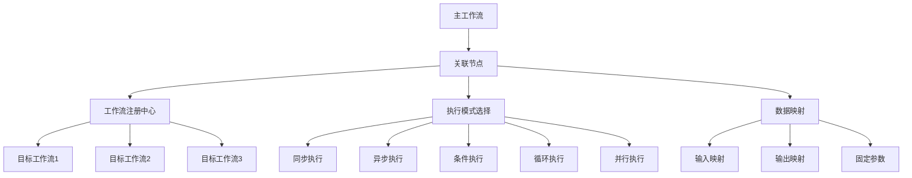

# LogFlow 工作流关联节点指南

## 🎯 概述

**关联节点（ReferenceNode）**是LogFlow工作流系统的高级功能，允许一个工作流引用和执行其他已注册的工作流，实现工作流的**组合**、**复用**和**编排**。这是构建复杂业务流程的核心能力。

## 🏗️ 核心架构

### 关键组件

1. **ReferenceNode** - 关联节点实现
2. **WorkflowRegistry** - 工作流注册中心  
3. **ExecutionMode** - 多种执行模式
4. **数据映射机制** - 工作流间数据传递
5. **条件评估引擎** - 智能执行控制

### 系统特性



## 🚀 执行模式详解

### 1. 同步执行模式 (SYNC)

**最基础的执行模式**，关联节点等待被引用工作流完全执行完成后再继续。

```yaml
nodes:
  - id: ref-sync
    type: reference
    name: 同步数据处理
    config:
      executionMode: SYNC
      workflowId: data-processing-workflow
      inputMappings:
        source_data: input_data
        config_params: processing_config
      outputMappings:
        processed_result: main_result
        statistics: processing_stats
```

**特点**：
- ✅ 简单可靠，结果确定
- ✅ 便于调试和错误处理
- ⚠️ 可能造成长时间阻塞
- 📊 适用于数据依赖性强的场景

### 2. 异步执行模式 (ASYNC)

**非阻塞执行**，启动子工作流后可选择等待结果或继续执行。

```yaml
nodes:
  - id: ref-async
    type: reference
    name: 异步报告生成
    config:
      executionMode: ASYNC
      workflowId: report-generator
      waitForResult: false
      timeoutMs: 30000
      inputMappings:
        report_data: analysis_result
```

**特点**：
- ⚡ 高并发，性能优异
- 🔄 支持后台长时间任务
- ⚠️ 需要处理异步结果管理
- 📊 适用于独立的后台任务

### 3. 条件执行模式 (CONDITIONAL)

**基于条件的智能执行**，只有满足特定条件时才执行子工作流。

```yaml
nodes:
  - id: ref-conditional
    type: reference
    name: 条件数据清理
    config:
      executionMode: CONDITIONAL
      condition: "${error_count} > 0"
      workflowId: error-cleanup-workflow
      inputMappings:
        error_data: detected_errors
```

**条件表达式语法**：
```javascript
// 数值比较
"${count} > 100"
"${ratio} >= 0.8"
"${temperature} < 50"

// 字符串比较  
"${status} == 'success'"
"${environment} != 'production'"

// 布尔值检查
"${enabled} == true"
"${has_errors} == false"

// 存在性检查
"${result_data}"
```

**特点**：
- 🎯 智能决策，节省资源
- 🧠 支持复杂业务逻辑
- ⚡ 避免不必要的执行
- 📊 适用于分支处理场景

### 4. 循环执行模式 (LOOP)

**批量数据处理**，对数据集合中的每个元素执行相同的子工作流。

```yaml
nodes:
  - id: ref-loop
    type: reference
    name: 批量文件处理
    config:
      executionMode: LOOP
      workflowId: file-processor
      loopDataKey: file_list
      maxIterations: 100
      inputMappings:
        loopItem: current_file
        loopIndex: file_index
```

**循环类型**：

1. **数据列表循环**：
```java
// 遍历文件列表
List<String> fileList = Arrays.asList("file1.txt", "file2.txt", "file3.txt");
context.setData("file_list", fileList);
```

2. **条件循环**：
```yaml
config:
  loopCondition: "${processed_count} < ${total_count}"
  maxIterations: 1000
```

**特点**：
- 🔄 自动批量处理
- 📊 支持进度跟踪
- ⚠️ 需要防止无限循环
- 📊 适用于ETL和批处理场景

### 5. 并行执行模式 (PARALLEL)

**同时执行多个工作流**，显著提升处理效率。

```yaml
nodes:
  - id: ref-parallel
    type: reference
    name: 并行数据分析
    config:
      executionMode: PARALLEL
      workflowIds:
        - statistical-analysis
        - data-validation
        - quality-check
      parallelTimeoutMs: 60000
      inputMappings:
        analysis_data: input_dataset
```

**特点**：
- ⚡ 极高的处理效率
- 🚀 充分利用系统资源
- ⚠️ 需要管理并发复杂性
- 📊 适用于独立的并行任务

## 🗃️ 工作流注册中心

### 基本操作

```java
WorkflowRegistry registry = WorkflowRegistry.getInstance();

// 注册工作流
registry.registerWorkflow(workflow, WorkflowStatus.ACTIVE, "描述", "1.0.0");

// 获取工作流
Workflow targetWorkflow = registry.getWorkflow("workflow-id");

// 检查存在性
boolean exists = registry.hasWorkflow("workflow-id");

// 获取所有活跃工作流
Set<String> activeIds = registry.getActiveWorkflowIds();
```

### 依赖关系管理

```java
// 添加依赖
registry.addWorkflowDependency("main-workflow", "dependency-workflow");

// 检查循环依赖
boolean hasCircular = registry.hasCircularDependency("workflow-id");

// 获取依赖此工作流的其他工作流
Set<String> dependents = registry.getWorkflowDependents("workflow-id");
```

### 搜索和统计

```java
// 搜索工作流
List<WorkflowInfo> results = registry.searchWorkflows("数据处理");

// 获取统计信息
RegistryStatistics stats = registry.getStatistics();
System.out.println("总工作流: " + stats.getTotalWorkflows());
System.out.println("活跃工作流: " + stats.getStatusCounts().get(WorkflowStatus.ACTIVE));
```

## 📊 数据映射机制

### 输入映射 (inputMappings)

将主工作流的数据映射到子工作流的输入参数：

```yaml
inputMappings:
  main_data: sub_input          # 主工作流的main_data -> 子工作流的sub_input
  config_params: sub_config     # 主工作流的config_params -> 子工作流的sub_config
  user_info: processing_context # 主工作流的user_info -> 子工作流的processing_context
```

### 输出映射 (outputMappings)

将子工作流的输出结果映射回主工作流：

```yaml
outputMappings:
  sub_result: main_result       # 子工作流的sub_result -> 主工作流的main_result
  statistics: execution_stats   # 子工作流的statistics -> 主工作流的execution_stats
  logs: processing_logs        # 子工作流的logs -> 主工作流的processing_logs
```

### 固定参数 (fixedParameters)

为子工作流提供固定的配置参数：

```yaml
fixedParameters:
  timeout: 30000
  retry_count: 3
  environment: "production"
  debug_mode: false
```

### 自动注入参数

系统自动为子工作流注入元数据：

```java
// 自动注入的参数
_sourceWorkflowId: "main-workflow"     // 来源工作流ID
_sourceExecutionId: "exec-12345"       // 来源执行ID  
_referenceNodeId: "ref-node-01"        // 关联节点ID
```

## 🛠️ 使用指南

### 基础用法

```java
// 1. 创建和注册目标工作流
Workflow targetWorkflow = WorkflowBuilder.create("data-processor", "数据处理")
    .addInputNode("input", "数据输入")
    .addScriptNode("process", "数据处理")
    .addOutputNode("output", "结果输出")
    .connect("input", "process")
    .connect("process", "output")
    .build();

WorkflowRegistry.getInstance().registerWorkflow(targetWorkflow);

// 2. 创建包含关联节点的主工作流
Workflow mainWorkflow = WorkflowBuilder.create("main", "主工作流")
    .addInputNode("input", "主输入")
    .addReferenceNode("ref", "关联处理")
    .withConfig(Map.of(
        "executionMode", "SYNC",
        "workflowId", "data-processor",
        "inputMappings", Map.of("input_data", "input_data"),
        "outputMappings", Map.of("processed_data", "result_data")
    ))
    .addOutputNode("output", "主输出")
    .connect("input", "ref")
    .connect("ref", "output")
    .build();

// 3. 执行主工作流
WorkflowEngine engine = new WorkflowEngine();
WorkflowExecutionResult result = engine.execute(mainWorkflow, inputData);
```

### 高级配置

```yaml
# 完整的关联节点配置示例
nodes:
  - id: advanced-reference
    type: reference
    name: 高级关联节点
    config:
      # 执行模式
      executionMode: CONDITIONAL
      
      # 条件设置
      condition: "${validation_passed} == true && ${error_count} < 5"
      
      # 目标工作流
      workflowId: advanced-data-processor
      
      # 数据映射
      inputMappings:
        source_data: processing_input
        config_settings: processor_config
        metadata: execution_metadata
      
      outputMappings:
        processed_result: main_result
        processing_stats: execution_statistics
        error_log: processing_errors
      
      # 固定参数
      fixedParameters:
        processor_version: "2.1.0"
        max_memory: "2GB"
        timeout_seconds: 300
        retry_enabled: true
      
      # 异步设置（如果是异步模式）
      waitForResult: true
      timeoutMs: 60000
      
      # 循环设置（如果是循环模式）
      loopDataKey: batch_items
      loopCondition: "${batch_index} < ${total_batches}"
      maxIterations: 1000
      
      # 并行设置（如果是并行模式）
      workflowIds:
        - data-validator
        - quality-checker
        - statistics-generator
      parallelTimeoutMs: 120000
```

## 🔧 最佳实践

### 1. 工作流设计原则

**单一职责**：
```java
// ✅ 好的设计 - 每个工作流专注一个功能
register("data-extractor", extractorWorkflow);    // 专注数据提取
register("data-transformer", transformerWorkflow); // 专注数据转换  
register("data-loader", loaderWorkflow);           // 专注数据加载

// ❌ 不好的设计 - 一个工作流做所有事情
register("data-etl-everything", massiveWorkflow);
```

**可复用性**：
```java
// ✅ 设计可复用的通用工作流
register("email-sender", emailWorkflow);      // 通用邮件发送
register("file-archiver", archiveWorkflow);   // 通用文件归档
register("audit-logger", auditWorkflow);      // 通用审计日志

// 在多个地方复用
mainWorkflow.addReferenceNode("send-email", "发送通知")
    .withConfig(Map.of("workflowId", "email-sender"));
```

### 2. 错误处理策略

**优雅降级**：
```yaml
# 主处理流程
- id: primary-processor
  type: reference
  config:
    executionMode: SYNC
    workflowId: primary-data-processor

# 备用处理流程  
- id: fallback-processor
  type: reference
  config:
    executionMode: CONDITIONAL
    condition: "${primary_failed} == true"
    workflowId: fallback-data-processor
```

**重试机制**：
```java
// 在子工作流中实现重试逻辑
Workflow resilientWorkflow = WorkflowBuilder.create("resilient-processor", "容错处理")
    .addScriptNode("retry-logic", "重试控制")
    .withScript("""
        var maxRetries = context.getData('max_retries') || 3;
        var currentTry = context.getData('current_try') || 0;
        
        if (currentTry < maxRetries) {
            context.setData('should_retry', true);
            context.setData('current_try', currentTry + 1);
        } else {
            context.setData('should_retry', false);
            context.setData('max_retries_reached', true);
        }
    """)
    .build();
```

### 3. 性能优化

**并行处理**：
```yaml
# 将独立任务并行化
- id: parallel-analysis
  type: reference
  config:
    executionMode: PARALLEL
    workflowIds:
      - statistical-analysis    # 统计分析
      - sentiment-analysis      # 情感分析  
      - keyword-extraction      # 关键词提取
    parallelTimeoutMs: 30000
```

**资源管理**：
```java
// 合理设置超时和资源限制
Map<String, Object> config = Map.of(
    "timeoutMs", 30000,           // 30秒超时
    "maxIterations", 1000,        // 最大1000次迭代
    "parallelTimeoutMs", 60000    // 并行超时60秒
);
```

### 4. 监控和调试

**执行跟踪**：
```java
// 在关联节点中添加跟踪信息
Map<String, Object> params = Map.of(
    "input_data", actualData,
    "_trace_id", "trace-" + UUID.randomUUID(),
    "_parent_workflow", mainWorkflow.getId(),
    "_execution_timestamp", System.currentTimeMillis()
);
```

**日志记录**：
```yaml
# 在每个关键工作流中添加日志节点
- id: audit-log
  type: script
  name: 执行审计
  config:
    script: |
      var auditInfo = {
        workflow_id: context.getWorkflowId(),
        execution_id: context.getExecutionId(),
        start_time: new Date().toISOString(),
        input_size: JSON.stringify(context.getData('input_data')).length
      };
      context.setData('audit_info', auditInfo);
      logger.info('工作流执行审计: ' + JSON.stringify(auditInfo));
```

## 📈 性能特征

### 执行模式性能对比

| 执行模式 | 延迟 | 吞吐量 | 资源占用 | 复杂度 | 适用场景 |
|---------|------|--------|----------|--------|----------|
| SYNC | 高 | 低 | 低 | 低 | 串行处理、强依赖 |
| ASYNC | 低 | 高 | 中 | 中 | 后台任务、弱依赖 |
| CONDITIONAL | 中 | 中 | 低 | 中 | 分支逻辑、条件处理 |
| LOOP | 高 | 中 | 中 | 中 | 批量处理、ETL |
| PARALLEL | 低 | 极高 | 高 | 高 | 并行计算、独立任务 |

### 最佳性能实践

1. **选择合适的执行模式**
   - 数据依赖强 → SYNC
   - 独立后台任务 → ASYNC  
   - 条件分支 → CONDITIONAL
   - 批量处理 → LOOP
   - 并行计算 → PARALLEL

2. **优化数据传输**
   - 只映射必要的数据字段
   - 避免传递大型对象
   - 使用引用而非复制

3. **合理设置超时**
   - 根据业务需求设定合理超时
   - 避免过长的阻塞等待
   - 实现超时后的降级处理

## 🔮 未来扩展

### 计划中的功能

1. **动态工作流发现**
   - 基于标签的工作流查找
   - 版本兼容性检查
   - 自动依赖解析

2. **高级调度策略**
   - 基于负载的智能调度
   - 优先级队列管理
   - 资源预留机制

3. **分布式执行**
   - 跨节点工作流执行
   - 负载均衡和故障转移
   - 分布式状态管理

4. **可视化编排**
   - 图形化工作流设计器
   - 实时执行监控面板
   - 性能分析和优化建议

## 📚 示例集合

### 典型业务场景

1. **数据处理流水线**
```yaml
# ETL流水线示例
workflow:
  id: etl-pipeline
  name: 数据ETL流水线
  nodes:
    - id: extract
      type: reference
      config:
        executionMode: SYNC
        workflowId: data-extractor
        
    - id: transform  
      type: reference
      config:
        executionMode: SYNC
        workflowId: data-transformer
        inputMappings:
          extracted_data: raw_data
          
    - id: load
      type: reference
      config:
        executionMode: SYNC
        workflowId: data-loader
        inputMappings:
          transformed_data: clean_data
```

2. **微服务编排**
```yaml
# 微服务协调示例
workflow:
  id: order-processing
  name: 订单处理流程
  nodes:
    - id: validate-order
      type: reference
      config:
        executionMode: SYNC
        workflowId: order-validator
        
    - id: parallel-processing
      type: reference
      config:
        executionMode: PARALLEL
        workflowIds:
          - inventory-check
          - payment-processor  
          - shipping-calculator
          
    - id: order-confirmation
      type: reference
      config:
        executionMode: CONDITIONAL
        condition: "${all_services_success} == true"
        workflowId: order-confirmer
```

3. **AI/ML流水线**
```yaml
# 机器学习流水线示例  
workflow:
  id: ml-pipeline
  name: 机器学习流水线
  nodes:
    - id: data-preprocessing
      type: reference
      config:
        executionMode: SYNC
        workflowId: data-preprocessor
        
    - id: feature-engineering
      type: reference  
      config:
        executionMode: LOOP
        workflowId: feature-extractor
        loopDataKey: feature_groups
        
    - id: model-training
      type: reference
      config:
        executionMode: ASYNC
        workflowId: model-trainer
        waitForResult: true
        timeoutMs: 1800000  # 30分钟
```

## 🎯 总结

LogFlow的关联节点功能提供了强大的**工作流编排和复用能力**，通过多种执行模式和灵活的数据映射机制，可以构建从简单到复杂的各种业务流程。

### 核心价值

1. **📊 提升复用性** - 一次开发，多处使用
2. **🚀 增强灵活性** - 多种执行模式适应不同场景  
3. **⚡ 改善性能** - 并行和异步执行提升效率
4. **🎯 简化管理** - 统一的注册中心管理所有工作流
5. **🛡️ 保证可靠性** - 完善的错误处理和监控机制

LogFlow关联节点使复杂业务流程的构建变得**简单、高效、可维护**，是企业级工作流系统的重要基础设施。
